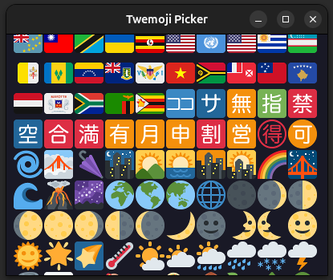

# Emoji Launcher

Emoji Picker for Linux and Windows.
Getting it to work for MacOS would be trivial, too, but I have no system to test it (just add the LWJGL libraries).

This project was developed for Ubuntu.

The emojis are from [Twemoji](https://github.com/twitter/twemoji),
and the names for filtering have been taken from [Unicode.com](https://unicode.org/Public/emoji/latest/).